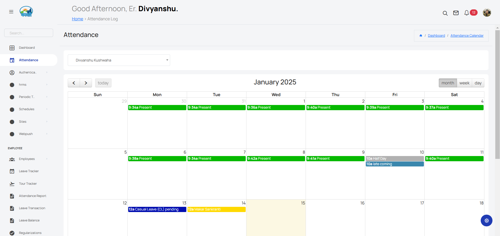
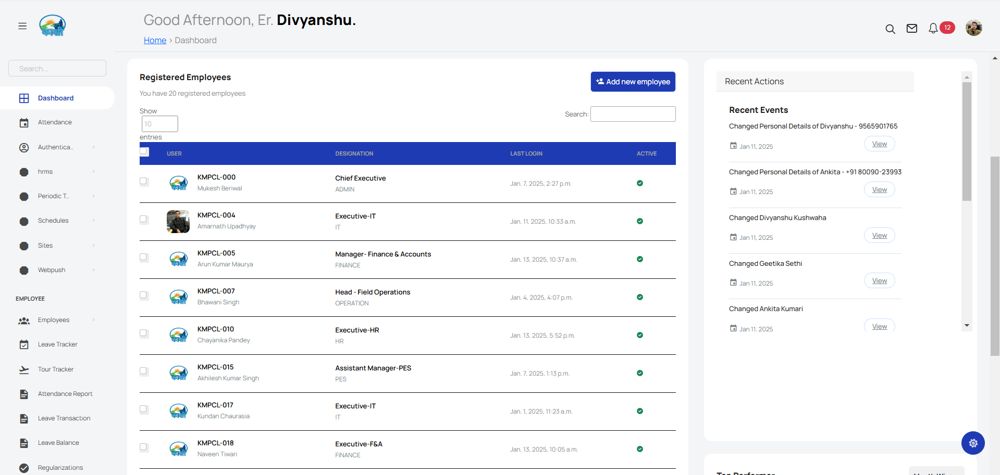
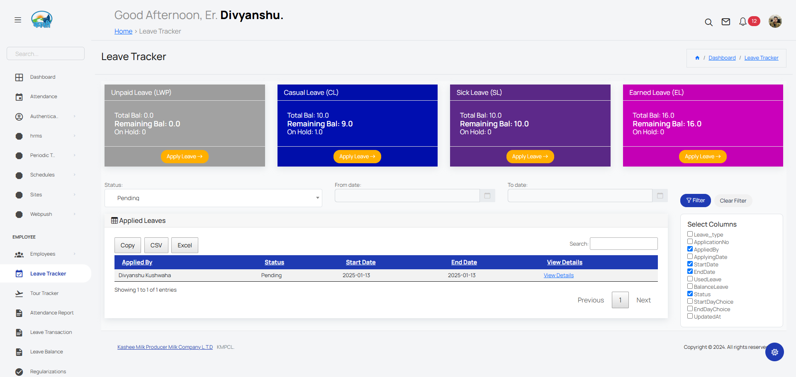
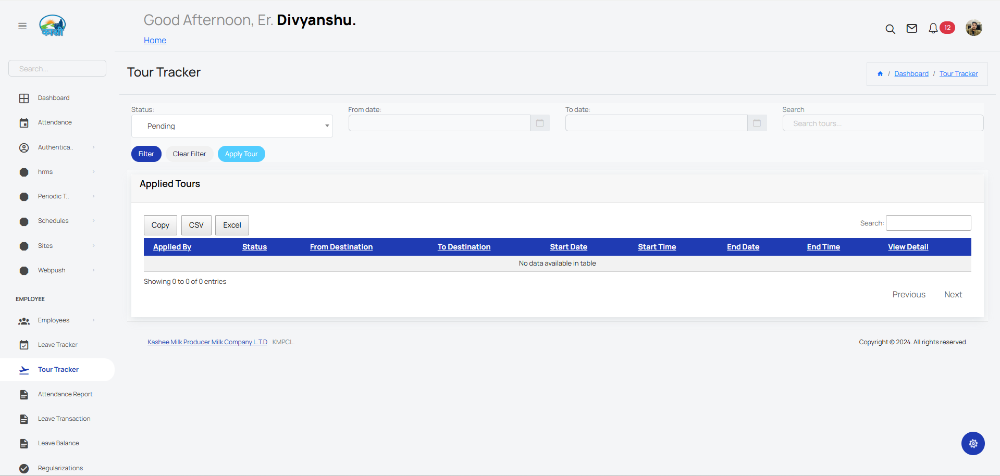
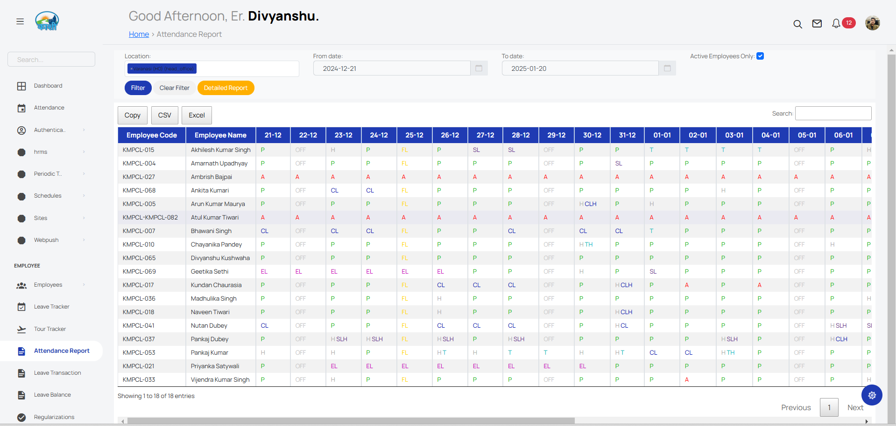

# Attendance Log


# Dashboard


# Leave Tracker


# Tour Tracker


# Attendance Report


# Deployment Guide for Django Project with Celery, Daphne, and Nginx

This document provides instructions to set up and manage a Django project using Celery for asynchronous tasks, Daphne for serving ASGI applications, and Nginx as a reverse proxy.

---

## **1. Running Celery**

### **Steps to Start Celery:**
1. Activate the virtual environment:
   ```bash
   source /path/to/venv/bin/activate
   ```

2. Run the Celery worker:
   ```bash
   celery -A <project_name> worker --loglevel=info
   ```

### **Supervisor Configuration for Celery**
1. Create a Supervisor configuration file:
   ```bash
   sudo nano /etc/supervisor/conf.d/celery.conf
   ```

2. Add the following content:
   ```ini
   [program:celery]
   command=/path/to/venv/bin/celery -A <project_name> worker --loglevel=info
   directory=/path/to/project
   user=<user>
   autostart=true
   autorestart=true
   stdout_logfile=/var/log/celery.log
   stderr_logfile=/var/log/celery_err.log
   ```

3. Reload Supervisor and start Celery:
   ```bash
   sudo supervisorctl reread
   sudo supervisorctl update
   sudo supervisorctl start celery
   ```

### **Checking Celery Logs:**
- Standard Logs:
  ```bash
  sudo tail -f /var/log/celery.log
  ```
- Error Logs:
  ```bash
  sudo tail -f /var/log/celery_err.log
  ```

---

## **2. Running Daphne**

### **Steps to Start Daphne:**
1. Install Daphne (if not already installed):
   ```bash
   pip install daphne
   ```

2. Run Daphne manually:
   ```bash
   daphne -b 0.0.0.0 -p 8000 <project_name>.asgi:application
   ```

### **Supervisor Configuration for Daphne**
1. Create a Supervisor configuration file:
   ```bash
   sudo nano /etc/supervisor/conf.d/daphne.conf
   ```

2. Add the following content:
   ```ini
   [program:daphne]
   command=/path/to/venv/bin/daphne -b 0.0.0.0 -p 8000 <project_name>.asgi:application
   directory=/path/to/project
   user=<user>
   autostart=true
   autorestart=true
   stdout_logfile=/var/log/daphne.log
   stderr_logfile=/var/log/daphne_err.log
   ```

3. Reload Supervisor and start Daphne:
   ```bash
   sudo supervisorctl reread
   sudo supervisorctl update
   sudo supervisorctl start daphne
   ```

### **Checking Daphne Logs:**
- Standard Logs:
  ```bash
  sudo tail -f /var/log/daphne.log
  ```
- Error Logs:
  ```bash
  sudo tail -f /var/log/daphne_err.log
  ```

---

## **3. Configuring Nginx**

### **Nginx Configuration File:**
1. Create an Nginx configuration file:
   ```bash
   sudo nano /etc/nginx/sites-available/<project_name>
   ```

2. Add the following content:
   ```nginx
   server {
       listen 80;
       server_name <your_domain_or_ip>;

       location /static/ {
           alias /path/to/static/;
       }

       location /media/ {
           alias /path/to/media/;
       }

       location / {
           proxy_pass http://127.0.0.1:8000;
           proxy_http_version 1.1;
           proxy_set_header Upgrade $http_upgrade;
           proxy_set_header Connection "upgrade";
           proxy_set_header Host $host;
           proxy_cache_bypass $http_upgrade;
       }
   }
   ```

3. Enable the configuration:
   ```bash
   sudo ln -s /etc/nginx/sites-available/<project_name> /etc/nginx/sites-enabled/
   ```

4. Test and restart Nginx:
   ```bash
   sudo nginx -t
   sudo systemctl restart nginx
   ```

### **Checking Nginx Logs:**
- Access Logs:
  ```bash
  sudo tail -f /var/log/nginx/access.log
  ```
- Error Logs:
  ```bash
  sudo tail -f /var/log/nginx/error.log
  ```

---

## **4. Additional Management Commands**

### **Supervisor Commands:**
- Check status:
  ```bash
  sudo supervisorctl status
  ```
- Restart a service:
  ```bash
  sudo supervisorctl restart <service_name>
  ```

### **Redis Commands:**
- Start Redis manually:
  ```bash
  redis-server
  ```
- Check Redis logs:
  ```bash
  sudo tail -f /var/log/redis.log
  ```

### **Collect Static Files:**
1. Run the Django management command:
   ```bash
   python manage.py collectstatic
   ```

---

## **5. General Debugging Tips**
1. Check if Supervisor is running:
   ```bash
   sudo systemctl status supervisor
   ```

2. Validate service configurations:
   ```bash
   sudo nginx -t
   ```

3. Check application logs for detailed errors.
   - Celery, Daphne, and Nginx logs as listed above.

4. Ensure all paths in configurations are correct.

---

By following these instructions, you can set up and manage your Django project effectively.

